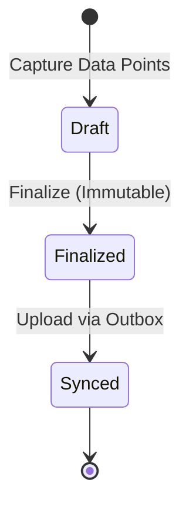
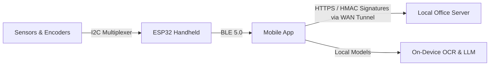

# Product Requirements Document: HVAC Helper Pro (v2)

## 1. Problem Statement

As an HVAC service technician, you carry multiple specialized diagnostic tools—including voltmeters, temperature probes, manifold gauges, and relative humidity sensors—and manually record readings on paper pads or fragmented mobile applications. This disconnected workflow creates the following operational challenges:

*   **Time Waste**: You spend 5 to 15 minutes per service call setting up tools, transcribing numbers, and validating calculation results.
*   **Data Inaccuracy**: Manual transcription introduces human error and creates incomplete, inconsistent service histories.
*   **Billing and Ordering Delays**: You delay sending paper notes or manual logs to the back office, which postpones invoicing and warranty parts ordering.

---

## 2. Goals & Success Metrics

Use the following metrics to measure the success of the HVAC Helper Pro system. You validate all baselines marked as assumptions during the Closed Beta phase.

| Metric | Business Goal | Baseline | Target | Measurement Window |
| :--- | :--- | :---: | :---: | :--- |
| **On-Site Capture Time** | Reduce average minutes per service call spent capturing data. | 10–15 min *(Assumption)* | ≤ 5 min | 60 days post-launch |
| **Service Record Accuracy** | Increase the percentage of service records with complete, error-free readings. | 78% *(Assumption)* | ≥ 95% | 90 days post-launch |
| **Technician Satisfaction** | Boost Net Promoter Score (NPS) for field tools. | N/A | ≥ 7 | 90 days post-launch |
| **Office Entry Effort** | Reduce hours spent by office administrators entering field data manually. | 12 hours/week *(Assumption)* | ≤ 2 hours/week | 30 days post-launch |

> [!NOTE]
> You treat the current baselines (78% data accuracy and 12 hours/week back-office entry) as pilot-partner estimates and product assumptions to validate during the Closed Beta phase.

---

## 3. Non-Goals

Focus the MVP on core value by excluding the following features from scope:

*   **Touchscreen Interface**: You do not design a touchscreen UI. The handheld device uses physical buttons, rotary encoders, and a single top display.
*   **Built-In Pressure Sensors**: You do not measure refrigerant pressure directly. You dial in refrigerant saturation temperatures manually using the rotary encoders based on your physical pressure gauges.
*   **Direct Cloud Sync**: The handheld device does not connect directly to cellular networks or Wi-Fi. You transmit data locally to the mobile application via Bluetooth Low Energy (BLE), and the mobile app handles replication to the local office server/database.
*   **Advanced Diagnostics**: The system calculates only target parameters derived from the core data set (Evaporator Delta T, Superheat, and Subcooling) and does not perform automated component-level diagnostics.

---

## 4. User Personas

The system supports three user roles within the HVAC service lifecycle:

### Primary Persona: Field Service Technician

*   **Profile**: Marcus "Sparky" Ramirez (34, Journeyman). He performs residential split-system air conditioning maintenance and diagnostics in high-temperature environments (Dallas-Fort Worth, TX). He carries a physical tool bag, climbs ladders, and uses his personal smartphone (iPhone in a rugged case) for work tasks.
*   **Behavioral Patterns**: He values speed, tactile reliability, and protecting himself from callback liability. He trusts his own calibrated analog or digital manifold gauges and wants to capture data points without taking off his safety gloves or navigating complex software screens.
*   **Pain Points**: Sweating in cramped spaces, typing on touchscreens with dirty fingers, short battery life, and cellular dead zones.

### Secondary Persona: Apprentice Technician

*   **Profile**: Tyler Vance (20, Apprentice). He assists Lead Technicians while completing trade school part-time. He is a digital native and expects intuitive, step-by-step guidance.
*   **Behavioral Patterns**: He wants to avoid diagnostic mistakes and needs support placing temperature clamps or understanding superheat/subcooling calculations.
*   **Pain Points**: Low confidence in system line identification (suction vs. liquid line), memorizing charging formulas, and feeling rushed on-site.

### Secondary Persona: Office Administrator

*   **Profile**: Donna Jenkins (45, Service Manager). She coordinates dispatching, processes billing, orders warranty parts, and manages client invoices from a desktop-first office environment.
*   **Behavioral Patterns**: She reviews field records to generate homeowner invoices and file equipment warranty claims. She requires structured, complete, and verified data.
*   **Pain Points**: Deciphering illegible notes, calling technicians back to retrieve missing serial numbers, and delayed payment cycles due to incomplete documentation.

---

## 5. The Snapshot

The **Snapshot** is the central data object of the HVAC Helper Pro system. It models the complete set of system measurements for a service call. You can view the full schema definition in [snapshot-schema.md](file:///c:/Users/joshu/projects/hvac-helper-tool/docs/snapshot-schema.md).

### Lifecycle States

*   **Draft**: You edit and update the snapshot locally on the mobile app during active capture.
*   **Finalized**: Once complete, the snapshot becomes immutable and queues in the app's local persistent **Outbox** for transmission.
*   **Synced**: The snapshot uploads successfully to the cloud database.

### Core Structure and Validation Rules

*   Your Snapshot must contain exactly one **Before Set** and exactly one **After Set**.
*   Each measurement set (Before/After) consists of six **Data Points**:
    1.  **Return Air (RA)**: Temperature and relative humidity.
    2.  **Supply Air (SA)**: Temperature.
    3.  **Outdoor Ambient (OA)**: Temperature.
    4.  **Discharge Air (DA)**: Temperature.
    5.  **Suction Line (SL)**: Pipe temperature and saturation temperature.
    6.  **Liquid Line (LL)**: Pipe temperature and saturation temperature.
*   **Capture Limits**:
    *   Capture the **Before Set** measurements no older than 20 minutes before your first button press.
    *   Capture the **After Set** measurements within 20 minutes of your final button press.
*   **Timeout**: If you do not confirm a captured data point in the app within 20 minutes, that individual measurement expires and you must recapture it.
*   **Revision**: To correct a finalized snapshot, you copy the snapshot, increment the revision number, link it to the parent ID, and upload it as a new audit record.
*   **EPA Section 608 Compliance Fields**: To satisfy federal EPA audit requirements for refrigerant recovery and leak tracking, the Snapshot captures:
    *   `technician_epa_license_number` (certified operator link)
    *   `refrigerant_added_lbs` and `refrigerant_recovered_lbs` (material movement log)
    *   `recovery_cylinder_id` (disposal traceability)
    *   `leak_inspection_performed` and `leak_verification_method` (leak service tracking)
    *   `initial_verification_status` and `followup_verification_status` (verification test status logs)

---

## 6. Solution Overview

### 6.1 Device

You capture measurements using a rugged, IP-54 sealed handheld unit (~200g) featuring:
*   **Sensors**: A built-in Sensirion SHT40 temperature/humidity sensor and two 3.5mm ports for external pipe clamp temperature probes.
*   **Controls**: Four physical tactile **buttons** (Return Air, Supply Air, Outdoor Ambient, and Discharge Air) and two digital **rotary encoders** with integrated push-buttons (Suction Line and Liquid Line).
*   **Displays**: A single high-contrast 128x64 display at the top of the handheld device displaying all raw measurements, saturation dials, calculations, and active target ranges.
*   **Progress LEDs**: Six two-color (Yellow/Green) visual indicators next to each button or rotary encoder representing the capture state. It glows solid yellow if a reading is missing (needs capture), solid green when captured successfully, and flashes yellow if there is a sensor/probe fault.
*   **Physical Switch**: A BEFORE/AFTER slide switch that context-swaps display values and progress LEDs, and triggers a BLE re-transmission of all cached values in the selected set for sync recovery.
*   **Power**: A 2000mAh rechargeable Li-Po battery charging via USB-C, waking from deep sleep via button press or encoder push interrupts (GPIO EXT1).

### 6.2 Firmware

The ESP32 firmware manages local operations:
*   **Sensor Capture**: Reads digital temperature/humidity and analog clamp probe signals.
*   **Display Updates**: Performs updates to the Top Display via I2C.
*   **Local Calculations**: Computes Evaporator Delta T, Superheat, and Subcooling instantly using simple subtraction of captured and dialed-in values.
*   **BLE Assembly**: Packs measurements into structured payloads and handles transmission retries.
*   **Safety & Diagnostics**: Employs a hardware watchdog (5s) with reset-cause logging in non-volatile storage (NVS), check hooks for stack overflow, sleep caching of active measurements (context-swapped based on the BEFORE/AFTER switch position), and a dual-partition OTA rollback system requiring a BLE handshake confirmation loop with physical button rollback override (holding RA and SA for 5s during power-up).

### 6.3 Mobile App

You interface with the handheld using the iOS and Android application:
*   **Architecture**: Native SwiftUI (iOS) and Jetpack Compose (Android) frontends combined with a shared React Native logic layer.
*   **Local Caching**: Stores in-progress snapshots in a local SQLite database (offline-first). Creating a new revision clones all parent snapshot data (measurements and calculations) to allow simple metadata edits.
*   **Active Job Scope Caching**: Only caches historical records and notes for customers/sites assigned to the technician's upcoming 7-day schedule to prevent local storage bloat and maintain lookup speed.
*   **Communications**: Manages the BLE transmission queue, retrying failed packets within the 3-second **Transfer Latency** window.
*   **Camera OCR & Guided Wizard (Variant C)**: Implements the step-by-step Guided Wizard containing:
    *   **Auto-Capture Viewfinder**: Aligning the tag triggers camera scan automatically after 2.5s using local OCR libraries (Apple Vision / Google ML Kit).
    *   **Manual Trigger Bypass**: A manual capture button remains active if automatic scan confidence is low.
    *   **Review Crop Previews**: Displays zoomed photo segments of model and serial numbers side-by-side with recognized values and green targeting outlines.
    *   **OEM Badges**: Color-coded logo badges (Goodman: Red, Carrier: Blue, Trane: Orange) confirm context.
    *   **Dynamic Spec Parsing**: Auto-extracts specifications (MCA, SEER, Tonnage, Voltage) using local regex rules.
    *   **Service Tag Attachments**: Supports multiple service tag photo uploads, capturing millisecond-precision timestamps and active technician IDs, which are visually stamped on cards.
*   **Media Management**: Automatically downscales service tag photo attachments to a web-optimized JPEG format (maximum 1080p, 70% quality, ~150KB to 200KB per image) and strips EXIF location metadata before writing to the Outbox.
*   **User Feedback**: Provides an explicit sync drawer displaying queue progress. Completion triggers a dual-tap haptic pulse (150ms) and acoustic chime.

### 6.4 Office Server & WAN Sync

The office local server and tunnel services provide secure replication:
*   **Local Sync Gateway**: Exposes a local REST API (Node.js/Express + SQLite master database) hosted on the contractor's office PC or NAS, eliminating ongoing cloud hosting and storage costs.
*   **WAN Tunnel**: Exposes the local server securely to the WAN via a free **Cloudflare Tunnel** daemon (`cloudflared`), making the server accessible to technicians in the field via a secure HTTPS subdomain (e.g., `https://sync.myhvacshop.com`).
*   **HMAC Security & Authentication**: Protects the API endpoints by validating request signatures. Technicians sign requests using an HMAC-SHA256 hash containing client-generated timestamps. The server rejects signatures older than 300 seconds to block replay attacks.
*   **Rate Limiting**: Cloudflare rate-limiting rules block brute force and denial of service (DoS) attempts (maximum 10 requests/minute per device IP).
*   **Local Backup Engine**: Runs scheduled daily database dumps and photo compression archives to an external physical storage drive or NAS partition.

---

## 7. Functional Requirements

### User Stories & Acceptance Criteria

1.  **Record Return Air (RA)**
    *   *Story*: As a Field Service Technician, I want to press the **Return Air (RA)** button to capture the temperature and humidity of the air entering the indoor evaporator coil.
    *   *Acceptance Criteria*: You press the button to initiate the measurement; the associated progress LED turns solid green from yellow within 3 seconds of confirmation; the top display updates to show the captured value; the value syncs to the mobile app's active Draft.

2.  **Record Supply Air (SA)**
    *   *Story*: As a Field Service Technician, I want to press the **Supply Air (SA)** button to capture the temperature of the air leaving the evaporator coil.
    *   *Acceptance Criteria*: You press the button to capture the temperature; the progress LED turns solid green from yellow within 3 seconds; the top display updates to show the value; the value syncs to the mobile app's active Draft.

3.  **Record Outdoor Ambient (OA)**
    *   *Story*: As a Field Service Technician, I want to press the **Outdoor Ambient (OA)** button to capture the temperature of the air entering the condenser coil.
    *   *Acceptance Criteria*: You press the button to capture the temperature; the progress LED turns solid green from yellow within 3 seconds; the top display updates to show the value; the value syncs to the mobile app's active Draft.

4.  **Record Discharge Air (DA)**
    *   *Story*: As a Field Service Technician, I want to press the **Discharge Air (DA)** button to capture the temperature of the air leaving the condenser fan outlet.
    *   *Acceptance Criteria*: You press the button to capture the temperature; the progress LED turns solid green from yellow within 3 seconds; the top display updates to show the value; the value syncs to the mobile app's active Draft.

5.  **Dial Suction Line (SL) Saturation and Measure Suction Pipe Temperature**
    *   *Story*: As a Field Service Technician, I want to turn the **Suction Line (SL)** rotary encoder to match my physical pressure gauge's saturation temperature and push the dial to capture the suction pipe temperature.
    *   *Acceptance Criteria*: You turn the dial to adjust the displayed saturation temperature on the top display; you push the dial to capture the external clamp probe temperature and confirm both values; the progress LED turns solid green from yellow within 3 seconds; both values sync to the active Draft.

6.  **Dial Liquid Line (LL) Saturation and Measure Liquid Pipe Temperature**
    *   *Story*: As a Field Service Technician, I want to turn the **Liquid Line (LL)** rotary encoder to match my physical pressure gauge's saturation temperature and push the dial to capture the liquid pipe temperature.
    *   *Acceptance Criteria*: You turn the dial to adjust the displayed saturation temperature on the top display; you push the dial to capture the external clamp probe temperature and confirm both values; the progress LED turns solid green from yellow within 3 seconds; both values sync to the active Draft.

7.  **Review Live Calculations**
    *   *Story*: As a Field Service Technician, I want to view calculated parameters on the handheld's top display to verify system charging.
    *   *Acceptance Criteria*: You read real-time updates for Evaporator Delta T ($\Delta T$), Superheat, and Subcooling on the top-line OLED as soon as you capture their constituent measurements.

8.  **Automate Equipment Tag Entry**
    *   *Story*: As a Field Service Technician, I want to photograph the equipment service tag with the mobile app to extract model and serial numbers automatically.
    *   *Acceptance Criteria*: You take a photo of the tag; the app performs local OCR, extracts the model and serial numbers, displays them for you to verify or edit, and attaches them to the active Draft.

9.  **Dictate Service Notes**
    *   *Story*: As a Field Service Technician, I want to dictate my service notes hands-free so the app can format them.
    *   *Acceptance Criteria*: You dictate notes; the app transcribes the audio locally, and the on-device language model expands the text into a professional service description.

10. **Add Consumables Automatically**
    *   *Story*: As a Field Service Technician, I want the app to prompt me for consumables used based on my notes.
    *   *Acceptance Criteria*: You save the work description; the local model parses the text and prompts you to confirm identified consumables (e.g., filters, refrigerant pounds), appending them to the active Draft.

11. **Store Snapshots Offline**
    *   *Story*: As a Field Service Technician, I want my diagnostics saved when I work in cell dead zones.
    *   *Acceptance Criteria*: The app stores all in-progress snapshots locally in SQLite; when you tap the submit action, the finalized snapshot queues in the Outbox until cellular or Wi-Fi connectivity returns.

12. **Submit Diagnostic-Only Snapshots**
    *   *Story*: As a Field Service Technician, I want to submit a snapshot containing only initial measurements for diagnostic service calls.
    *   *Acceptance Criteria*: You tap the submit action; the app validates that the **Before Set** and equipment data are fully populated, marks the snapshot as `DIAGNOSTIC_COMPLETE`, and queues it in the Outbox.

13. **Finalize and Submit Completed Repairs**
    *   *Story*: As a Field Service Technician, I want to submit a complete snapshot containing before and after measurements along with automatically calculated performance deltas to prove my work.
    *   *Acceptance Criteria*: You tap the submit action; the app validates that the **Before Set**, **After Set**, equipment data, and notes are fully populated, calculates before-to-after performance deltas (Delta T, Superheat, and Subcooling changes), marks the snapshot as `COMPLETED`, and queues it in the Outbox.

14. **Process Invoices and Claims**
    *   *Story*: As an Office Administrator, I want to receive structured snapshot data automatically in our office CRM to process billing.
    *   *Acceptance Criteria*: The cloud backend receives finalized snapshots from the mobile app's Outbox, parses the JSON payload, updates the matching job card in the CRM/FSM system, and fires a parts-order trigger if consumables are listed.

---

## 8. Non-Functional Requirements

### 8.1 Technical Performance

*   **BLE Transmission Latency**: Ensure BLE transmission and confirmation complete within a 3-second window. The mobile app handles packet acknowledgment within 250ms of receipt.
*   **Display Update Latency**: Update the Top Display within 100ms of button presses, encoder rotation, or sensor data retrieval.
*   **App UI Thread Performance**: Maintain BLE event processing and UI thread rendering under 5ms per event to prevent frame drops.

### 8.2 Power Constraints

*   **Battery Life**: Design the battery system to support ≥ 10 hours of active, continuous operation.
*   **Idle Management**: Enter deep sleep after 5 seconds of button/encoder inactivity. The wake trigger must connect via GPIO interrupt (EXT1) to all physical buttons and rotary encoder switches.
*   **Battery Drain**: Limit handheld active battery drain to under 5% per hour. The mobile app must optimize BLE scan periods during idle times to keep app battery consumption under 5% per hour.

### 8.3 Security & Compliance

*   **Handheld Encryption**: Enable ESP32 Secure Boot and Flash Encryption at the silicon level. Secure signing keys and device credentials reside in hardware-protected NVS.
*   **Mobile Storage**: Encrypt all local database files at rest using native mobile security (iOS Keychain and Android EncryptedSharedPreferences).
*   **Cloud Transport**: Encrypt all client-to-cloud communications via HTTPS utilizing TLS 1.3.
*   **Privacy Regulation Compliance**: Store customer personally identifiable information (PII) separately from raw system measurement Snapshots, linking them only via an anonymized UUID to comply with state privacy regulations (e.g., CCPA/CPRA).
*   **EPA Retention Compliance**: Retain all raw measurement Snapshots in the database for a minimum of 3 years to comply with EPA Section 608 record-keeping rules and state residential contractor laws.

### 8.4 Accessibility

*   **Sunlight Theme Mode**: Provide a dedicated high-contrast theme featuring a pure black (`#000000`) on white (`#FFFFFF`) palette, yielding a **21:1 contrast ratio** readable in direct sunlight (10,000+ nits).
*   **Touch Targets**: Set interactive app targets to a minimum dimension of **64px** and a minimum spacing gutter of **16px** to support glove-wearing technicians.
*   **Color-Blind LED Indicators**: Ensure physical progress LEDs communicate state unambiguously without relying solely on color. Since they act as a checklist next to physical controls, a missing measurement shows solid yellow (needs capture), a successfully captured measurement shows solid green, and a sensor fault flashes yellow at 2 Hz. The top display provides a backup visual list of captured values with clear text labels.
*   **Color-Blind App Interface**: Ensure the mobile application matches the physical LED behavior by pairing state-based colors with distinct status labels (`Needs Capture`, `Captured`, `Fault`) and custom border styles:
    *   *Needs Capture*: Thin dashed border.
    *   *Captured*: Thick solid border with checkmark icon.
    *   *Fault*: Double-thickness solid border with alert icon.
*   **Haptic Mapping**: Trigger physical vibration cues to confirm capture and sync:
    *   *Success*: Single short tap (100ms).
    *   *Fault/Alert*: Double sharp pulse (200ms x 2).
*   **Reduced Motion**: Respect the OS setting `prefers-reduced-motion` by disabling CSS animations, replacing pulsing/flashing effects with static visual states.

---

## 9. Technical Considerations

The technical design details, architecture validation, and component selections are defined in the following Architectural Decision Records (ADRs). This PRD links directly to these records and does not duplicate their contents:

*   **Microcontroller Selection**: See [ADR-001 (ESP32 MCU)](file:///c:/Users/joshu/projects/hvac-helper-tool/docs/adr/0001-esp32-as-mcu.md).
*   **Wireless Protocol**: See [ADR-002 (BLE Transport)](file:///c:/Users/joshu/projects/hvac-helper-tool/docs/adr/0002-ble-5-0-as-transport.md).
*   **Pressure Interface**: See [ADR-003 (No Built-In Pressure Sensor)](file:///c:/Users/joshu/projects/hvac-helper-tool/docs/adr/0003-no-built-in-pressure-sensor.md).
*   **Display Architecture**: See [ADR-010 (Single Top Display)](file:///c:/Users/joshu/projects/hvac-helper-tool/docs/adr/0010-single-top-display.md) (which supersedes [ADR-0004](file:///c:/Users/joshu/projects/hvac-helper-tool/docs/adr/0004-per-button-mini-oleds-vs-single-display.md)).
*   **Progress LEDs and Switch**: See [ADR-011 (Progress Checklist LEDs and Switch)](file:///c:/Users/joshu/projects/hvac-helper-tool/docs/adr/0011-progress-checklist-leds-and-switch.md).
*   **Revision Inheritance and OCR Telemetry**: See [ADR-012 (Revision Inheritance and OCR Telemetry)](file:///c:/Users/joshu/projects/hvac-helper-tool/docs/adr/0012-revision-inheritance-and-ocr-telemetry.md).
*   **Mobile Framework**: See [ADR-005 (React Native Shared Logic & Native UI)](file:///c:/Users/joshu/projects/hvac-helper-tool/docs/adr/0005-rn-shared-logic-native-ui.md).
*   **AI Hosting Strategy**: See [ADR-006 (LLM Hosting: Cloud vs. On-Device)](file:///c:/Users/joshu/projects/hvac-helper-tool/docs/adr/0006-llm-hosting-cloud-vs-on-device.md).
*   **Data Synchronization**: See [ADR-007 (Snapshot Sync Semantics)](file:///c:/Users/joshu/projects/hvac-helper-tool/docs/adr/0007-snapshot-sync-semantics.md).
*   **Authentication & SSO**: See [ADR-008 (Cloud Auth & SSO)](file:///c:/Users/joshu/projects/hvac-helper-tool/docs/adr/0008-cloud-auth.md).
*   **Firmware Safety**: See [ADR-009 (OTA Update Signing)](file:///c:/Users/joshu/projects/hvac-helper-tool/docs/adr/0009-ota-update-model-signing.md).

---

## 10. Unit Economics & Go-To-Market (GTM)

### 10.1 Unit Economics Summary

The financial viability model details manufacturing costs, support limits, and break-even targets. For the full projections, see [unit-economics-v0.md](file:///c:/Users/joshu/projects/hvac-helper-tool/docs/unit-economics-v0.md).

*   **BOM Projections**: The total Bill of Materials (BOM) cost for the boxed product (including the handheld device and a pair of external clamp probes) scales from **$118.02** (100-unit pilot run) to **$74.28** (1,000-unit soft launch) and reaches **$38.84** at high-volume production (10,000 units).
*   **Non-Recurring Engineering (NRE)**: Fixed tooling and certification costs are estimated at **$62,000** for the baseline scenario, utilizing a pre-certified ESP32 RF module to minimize lab fees.
*   **Support & Cloud Margin**: Utilizing local, on-device language models for OCR and RAG reduces active token costs to $0.00. The baseline support cost is budgeted at **$10.00 per unit** over a 3-year device lifecycle to cover cloud database synchronization and legacy device fallbacks.
*   **Break-Even Targets**: At a target retail price of **$399.00**, the product reaches its break-even point at **197 units** for Direct-to-Consumer e-commerce, **249 units** via Amazon FBA, and **318 units** through Wholesale distribution channels.

### 10.2 Go-To-Market Summary

The market entry plan describes customer segments, pricing tiers, and channels. For the complete strategy, see [go-to-market-v0.md](file:///c:/Users/joshu/projects/hvac-helper-tool/docs/go-to-market-v0.md).

*   **Customer Segments**: The primary target segments include Sole Proprietor Technicians (focusing on diagnostic speed), Shop Owners (prioritizing technician utilization), Enterprise Franchises (demanding compliance audit logs), and Wholesale Distributors (focusing on retail turns).
*   **Pricing Models**:
    *   *Hardware MSRP*: $399.00 (includes the base app containing local diagnostics, local OCR, local PDF reports, and local on-device AI features on supported hardware).
    *   *SaaS Teams Subscription*: $19.00 per user/month (billed annually) for shop management portals, direct FSM integrations (e.g., ServiceTitan), custom-branded homeowner reports, automated compliance backups, and cloud-based LLM fallback support for legacy devices.
*   **Objection-Handling Playbooks**: The strategy details active technical demos addressing technician concern over screen-typing in the heat (demonstrating the rotary encoder dial-in flow) and owner concern over software adoption rates (demonstrating Apprentice Guided Mode).
*   **Closed Beta Validation**: A 10-technician Closed Beta program across 3 partner shops runs for 6 weeks. It establishes performance baselines, verifies hardware ergonomics under field conditions, and tracks sync reliability to convert beta partners into paying customers.

---

## 11. Risks

The following risks represent critical paths for hardware, software, and business validation:

*   **Bluetooth RF Attenuation**: Heavy sheet-metal condenser cabinets and concrete walls in commercial mechanical rooms can block the ESP32's BLE signal. You must conduct field attenuation testing during Closed Beta to determine if the enclosure design requires an external RF antenna.
*   **Glove Usability Gaps**: Technicians wearing heavy safety gloves may struggle to turn the rotary encoders accurately. Detent torque resistance must support glove use without causing input overshoot or slipping.
*   **FSM API Access Costs**: Commercial integrations with ServiceTitan or Housecall Pro are primary value drivers for Shop Owners. If these platforms charge prohibitive API access fees to write snapshot data, the Teams SaaS margins will degrade.
*   **EPA Regulatory Compliance**: The EPA or state licensing boards may legally challenge saturation temperatures derived from analog gauges via manual dial-in. You must confirm that digital logs containing manually confirmed saturation temperatures satisfy Section 608 record-keeping rules.
*   **High Retail Return Rates**: If technicians encounter Bluetooth pairing errors or registration friction at the supply counter, product returns will increase. The mobile app must feature self-service diagnostics to minimize counter-level returns.

---

## 12. Launch Plan

| Phase | Target Date | Audience | Key Success Gates |
| :--- | :--- | :--- | :--- |
| **Internal Alpha** | June 2026 | Engineering team and 2 pilot technicians. | *   All status LEDs confirm transmission in ≥ 90% of test runs. *   Handheld active battery run time ≥ 10 hours. |
| **Closed Beta** | July–August 2026 | 10 field technicians across 3 HVAC shops. | *   User satisfaction score ≥ 80%. *   BLE packet sync failure rate < 5%. *   Validation of baseline time and accuracy assumptions. |
| **General Availability** | Q4 2026 | All licensed residential HVAC technicians. | *   Complete coverage of all target success metrics. *   Regulatory and certification sign-offs (FCC, CE, UL, EPA). |

---

## 13. Open Questions

The following operational questions remain open and require validation during the Closed Beta phase:

*   What are the exact co-op advertising percentages and payment terms (e.g., 2% 10 Net 30) demanded by primary wholesale distributors (e.g., Ferguson, Johnstone Supply)?
*   Does ServiceTitan charge a recurring developer platform fee or transaction-based fee to write data into their system?
*   Do wholesale distributors require a mandatory inventory buy-back policy for unsold units after 180 days?
*   Does the EPA or state-level licensing board require actual raw pressure readings (PSIG) instead of dial-in saturation temperatures to satisfy Section 608 compliance logs?
*   What is the measured BLE attenuation in high-interference commercial zones, and does it necessitate a custom external antenna or specialized enclosure window?

---

## 14. Appendix

*   **Glossary of Domain Terms**: See [CONTEXT.md](file:///c:/Users/joshu/projects/hvac-helper-tool/CONTEXT.md).
*   **Design System Specifications**: See [design-system.md](file:///c:/Users/joshu/projects/hvac-helper-tool/docs/design-system.md).

### Architectural Decision Record Index

| ADR Number | ADR Name | Status |
| :---: | :--- | :--- |
| **ADR-001** | [ESP32 as MCU](file:///c:/Users/joshu/projects/hvac-helper-tool/docs/adr/0001-esp32-as-mcu.md) | Proposed |
| **ADR-002** | [BLE 5.0 as Transport](file:///c:/Users/joshu/projects/hvac-helper-tool/docs/adr/0002-ble-5-0-as-transport.md) | Proposed |
| **ADR-003** | [No Built-In Pressure Sensor](file:///c:/Users/joshu/projects/hvac-helper-tool/docs/adr/0003-no-built-in-pressure-sensor.md) | Proposed |
| **ADR-004** | [Per-Button Mini OLEDs vs. Single Display](file:///c:/Users/joshu/projects/hvac-helper-tool/docs/adr/0004-per-button-mini-oleds-vs-single-display.md) | Superseded |
| **ADR-005** | [React Native Shared Logic & Native UI](file:///c:/Users/joshu/projects/hvac-helper-tool/docs/adr/0005-rn-shared-logic-native-ui.md) | Proposed |
| **ADR-006** | [LLM Hosting: Cloud vs. On-Device](file:///c:/Users/joshu/projects/hvac-helper-tool/docs/adr/0006-llm-hosting-cloud-vs-on-device.md) | Proposed |
| **ADR-007** | [Snapshot Sync Semantics](file:///c:/Users/joshu/projects/hvac-helper-tool/docs/adr/0007-snapshot-sync-semantics.md) | Proposed |
| **ADR-008** | [Cloud Auth & SSO](file:///c:/Users/joshu/projects/hvac-helper-tool/docs/adr/0008-cloud-auth.md) | Proposed |
| **ADR-009** | [OTA Update Verification & Signing](file:///c:/Users/joshu/projects/hvac-helper-tool/docs/adr/0009-ota-update-model-signing.md) | Proposed |
| **ADR-010** | [Single Top Display](file:///c:/Users/joshu/projects/hvac-helper-tool/docs/adr/0010-single-top-display.md) | Accepted |
| **ADR-011** | [Progress Checklist LEDs and Switch](file:///c:/Users/joshu/projects/hvac-helper-tool/docs/adr/0011-progress-checklist-leds-and-switch.md) | Accepted |
| **ADR-012** | [Revision Inheritance and OCR Telemetry](file:///c:/Users/joshu/projects/hvac-helper-tool/docs/adr/0012-revision-inheritance-and-ocr-telemetry.md) | Accepted |
| **ADR-013** | [Cloudless WAN Sync via Local Office Server](file:///c:/Users/joshu/projects/hvac-helper-tool/docs/adr/0013-local-lan-sync-for-office.md) | Accepted |
