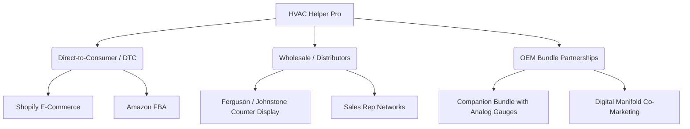

# HVAC Helper Pro – Go-To-Market (GTM) Strategy (v0 Draft)

This document outlines the commercial motion, target customer segmentation, distribution channels, technical objection-handling demo playbooks, and a validation-focused closed beta framework for **HVAC Helper Pro**. It bridges the technical product design defined in [PRD.md](file:///c:/Users/joshu/projects/hvac-helper-tool/docs/PRD.md) and [CONTEXT.md](file:///c:/Users/joshu/projects/hvac-helper-tool/CONTEXT.md) with the financial models established in [unit-economics-v0.md](file:///c:/Users/joshu/projects/hvac-helper-tool/docs/unit-economics-v0.md).

---

## 1. Target Customer Segmentation (Who Buys This?)

To successfully commercialize HVAC Helper Pro, we must separate the **User** (the technician in the field) from the **Buyer** (the individual holding the budget). We segment our market into four primary buyer categories:

### A. The Individual Technician & Sole Proprietor
*   **Profile**: Independent residential technicians, one-man owner-operators, or union sub-contractors who buy their own tools. Mapped to the *Marcus "Sparky" Ramirez* profile in [personas.md](file:///c:/Users/joshu/projects/hvac-helper-tool/docs/personas.md).
*   **Value Driver**: Personal efficiency, diagnostic speed, and professional status. They hate typing notes on their phone in the heat and want to protect themselves from callback liability ("the system was charging correctly when I left").
*   **Purchasing Power**: Low to moderate ($200–$500 out-of-pocket tool budget per year). 
*   **Buying Behavior**: Purchases from local supply houses, Amazon, or specialized tool sites (e.g., TruTech Tools). They rely heavily on peer reviews, YouTube tool channel reviews (e.g., *HVAC School*, *AC Service Tech LLC*), and Facebook groups.

### B. The Shop Owner / Small-to-Medium HVAC Business (5–50 Techs)
*   **Profile**: Local service companies run by a licensed contractor who now manages dispatch, billing, and team performance. Mapped to the operations environment of *Donna Jenkins* in [personas.md](file:///c:/Users/joshu/projects/hvac-helper-tool/docs/personas.md).
*   **Value Driver**: Technician utilization, invoice speed, callback reduction, and service report quality. If an apprentice forgets to record a serial number, the shop loses money waiting to order warranty parts.
*   **Purchasing Power**: Moderate ($2,000–$25,000 capital expenditure or software OpEx).
*   **Buying Behavior**: Buys tools in bulk directly from distributors or sales rep agencies. They look for fleet discounts, administrative dashboards, and direct software integrations with their Field Service Management (FSM) software (e.g., ServiceTitan, Housecall Pro).

### C. The Franchise Headquarters & Large Enterprise (50+ Techs)
*   **Profile**: Corporate decision-makers at national franchise networks (e.g., *One Hour Heating & Air Conditioning*, *Neighborly Group/Aire Serv*, *Apex Service Partners*).
*   **Value Driver**: Brand standardization, compliance audit logs (EPA Section 608 record keeping), junior technician training acceleration, and cross-fleet data monetization.
*   **Purchasing Power**: High ($50,000+ national contracts).
*   **Buying Behavior**: Formal RFPs, corporate procurement committees, and pilot evaluations. They demand strict data security, single sign-on (SSO) as highlighted in [0008-cloud-auth.md](file:///c:/Users/joshu/projects/hvac-helper-tool/docs/adr/0008-cloud-auth.md), and customized API integration.

### D. The Wholesale Distributor (Ferguson, Johnstone Supply)
*   **Profile**: Large commercial HVAC distributors stocking the physical shelves.
*   **Value Driver**: Shelf velocity, inventory turns, accessory attachments (selling our device alongside refrigerant cylinders and replacement coils), and supplier co-op marketing support.
*   **Purchasing Power**: Massive stocking orders.
*   **Buying Behavior**: Standard distributor agreements, requiring a minimum 30% discount off retail MSRP (as modeled in [unit-economics-v0.md](file:///c:/Users/joshu/projects/hvac-helper-tool/docs/unit-economics-v0.md)), stock-rotation privileges, and local counter-day marketing activations.

---

## 2. Distribution Channels & Commercialization Models

We will deploy a multi-channel sales strategy to balance high gross margins (Direct) with rapid volume scaling (Distributors). 



### A. Channel Mix & Financial Structuring
Based on the unit economics modeled in [unit-economics-v0.md](file:///c:/Users/joshu/projects/hvac-helper-tool/docs/unit-economics-v0.md), we will structure the channels at the **$399.00 Recommended MSRP**:

1.  **Direct-to-Consumer (DTC) E-Commerce (Shopify + Amazon FBA)**
    *   *Average Selling Price (ASP)*: $399.00 (Direct) / $334.15 (Amazon FBA, factoring 15% referral fee and $5 FBA pick/pack fee).
    *   *Target Margin*: **78% to 83%** contribution margin on a $74.28 COGS unit.
    *   *Role*: Captures the early adopter market (Marcus Ramirez types) and cash-flow-positive DTC sales.
2.  **Wholesale Distributor Network (Johnstone, Ferguson, RE Michel)**
    *   *Average Selling Price (ASP)*: $279.30 (30% discount off MSRP).
    *   *Target Margin*: **69%** contribution margin.
    *   *Role*: Essential channel for scaling volume. HVAC technicians are "immediate-need" buyers; they buy tools at the supply counter while picking up parts for a job. Counter placement drives brand legitimacy.
3.  **OEM Tool & Gauge Bundles (Yellow Jacket, Fieldpiece, Testo)**
    *   *Concept*: Since HVAC Helper Pro relies on technicians reading saturation temperatures directly from mechanical or basic digital gauges, we position the device as a "smart companion."
    *   *Model*: Co-package the device with mid-tier manifold gauges or temperature clamp kits. We sell bulk devices to the OEM at a 40% discount ($239.40 ASP), and they package it as a premium diagnostic bundle.

### B. The Hybrid SaaS Model: Hardware + Software Monetization
Because on-device LLMs and local RAG (Scenario B/D in [unit-economics-v0.md](file:///c:/Users/joshu/projects/hvac-helper-tool/docs/unit-economics-v0.md)) reduce active operational cloud fees to almost $0.00, we do not need to force individual technicians into a monthly subscription to make a profit. We will run a **Hybrid Model**:

*   **Free Tier (Included with Hardware)**: 
    *   Individual app license.
    *   Full offline diagnostics, local tag OCR, voice-to-text notes expansion, local PDF report generation.
    *   Saves data locally and exports to standard email/text reports.
    *   *AI Features Constraint*: AI notes expansion and consumables auto-itemization require hardware-accelerated local models. Legacy/older devices that do not support on-device execution will have these AI features disabled on the free tier.
*   **Pro Teams SaaS Subscription ($19/user/month, billed annually)**:
    *   Targeted at **Shop Owners (Donna Jenkins)**.
    *   **Features**:
        *   ServiceTitan, Housecall Pro, and QuickBooks CRM integrations.
        *   Manager dashboard to audit Apprentice diagnostics.
        *   Fleet-wide snapshot validation (ensures techs are actually capturing before/after sets).
        *   Custom-branded PDF report generation emailed automatically to the homeowner from the shop's domain.
        *   Persistent multi-year outbox backup and EPA Section 608 compliance audit export.
        *   *Legacy AI Fallback*: Unlocks the cloud-based LLM fallback endpoint, enabling advanced AI notes expansion and consumables auto-itemization on older/legacy technician smartphones.

---

## 3. Technical Objection Handling & Demos (By Segment)

Sales in the HVAC industry fail when the technical logic of the tool contradicts the field reality of the technician. As **Sales Engineers**, we address objections by demonstrating outcome-first technical solutions.

### Segment A: The Field Technician (Marcus Ramirez)
> [!IMPORTANT]
> **Objection**: *"I don't need another gadget. I've been troubleshooting with analog gauges and a pen for ten years. Pushing buttons and typing on an app is going to slow me down."*

*   **Technical Root Cause**: Technicians hate screen navigation while wearing gloves, and they fear tool failure (dead batteries, dropped screens).
*   **The Technical Demo ("The 120-Second Delta-T & Superheat Challenge")**:
    1.  **Quantify the Pain**: Place an analog manifold gauge and a notepad on the table. Ask the tech to calculate superheat. Watch them read the pressure dial, consult their physical PT card, clip a pipe probe, subtract the values, and write it down.
    2.  **Show the Outcome**: Open the mobile app. Push the Suction Line rotary encoder on the physical HVAC Helper Pro. Instantly, the mobile screen flashes a bright green "Target Superheat Met" card and drafts a professional service note.
    3.  **Reverse into the How**: Show them that by turning the physical rotary encoder dial (built for thick leather work gloves with heavy detents) to match their gauge's temperature ring, the ESP32 performs the subtraction instantly. No menus, no screen taps, no calculations.
    4.  **Close with Proof**: Show the IP-54 TPU rubber drop-proof chassis. Drop the device onto the floor in front of them to prove durability.

---

### Segment B: The Shop Owner (Donna Jenkins & Service Manager)
> [!IMPORTANT]
> **Objection**: *"My technicians are set in their ways. If I buy these tools, they'll sit in the truck boxes. I can't afford to waste capital on unused toys."*

*   **Technical Root Cause**: Fear of software adoption friction and training overhead for apprentices.
*   **The Technical Demo ("The Guided Apprentice Setup")**:
    1.  **Quantify the Pain**: Review their callbacks. 30% of callbacks are due to incorrect charge levels or apprentices placing probes on the wrong lines.
    2.  **Show the Outcome**: Open the app in "Guided Mode." Show how the screen guides Tyler (the apprentice) with high-contrast diagrams of a condenser, highlighting the suction line vs. liquid line.
    3.  **Reverse into the How**: Show how the status LEDs next to the buttons flash slow-pulse amber when waiting for data, and only turn solid green when the mobile app validates that the temperature is stable within typical HVAC operating thresholds.
    4.  **Close with Proof**: Show the "Incomplete Snapshot" dashboard. If a tech tries to submit a work order without a matching **After Set**, the system flags it. Show a case study of a 12-tech shop that reduced callbacks by 42% in 30 days.

---

### Segment C: The Franchise HQ / Enterprise
> [!IMPORTANT]
> **Objection**: *"We have our own custom CRM/FSM software. If your tool doesn't talk directly to our API, we'd have to double-key data, which kills our operational efficiency."*

*   **Technical Root Cause**: Data silos and security compliance concerns regarding client PII.
*   **The Technical Demo ("The OpenAPI Auto-Sync Integration")**:
    1.  **Quantify the Pain**: Show how much office time is wasted transcribing model numbers and pressure logs from scratch-pads into ServiceTitan.
    2.  **Show the Outcome**: Perform a mock service call. Snap a photo of a rusted model plate. Within 4 seconds, the extracted model, serial number, and exact before/after refrigerant delta are populated inside a mock ServiceTitan job card.
    3.  **Reverse into the How**: Demonstrate the versioned OpenAPI payload (`/api/v1/snapshots`) mapped in [api-v1-snapshots.md](file:///c:/Users/joshu/projects/hvac-helper-tool/docs/api-v1-snapshots.md). Explain how the app's outbox queues finalized payloads locally and uses WorkManager (Android/iOS) to execute secure, authenticated HTTPS uploads with idempotency keys.
    4.  **Close with Proof**: Walk through the zero-data-retention cloud fallback architecture that strips PII to satisfy CCPA/CPRA, keeping their legal department satisfied.

---

### Segment D: The Wholesale Distributor Counter Manager
> [!IMPORTANT]
> **Objection**: *"We don't have the shelf space or counter-time to teach guys how to use this. If it's too complicated, they'll buy it, get frustrated, and return it to us, costing us restock fees."*

*   **Technical Root Cause**: High return rates and support overhead for niche hardware products.
*   **The Technical Demo ("The Self-Service Counter Loop")**:
    1.  **Quantify the Pain**: Contrast this with digital manifolds that take 15 minutes of configuration and have a 12% return rate because of Bluetooth sync issues.
    2.  **Show the Outcome**: Place the device in a cardboard counter display box. The display includes a dummy device locked in "Demo Mode" and a QR code.
    3.  **Reverse into the How**: Have the counter manager press any button on the demo device. Within 1 second, the built-in mini-OLED displays a mockup temperature and the status LED turns solid green, showcasing the instant sub-second response.
    4.  **Close with Proof**: Explain the built-in firmware self-diagnostics and NVS error logging (per [PRD.md](file:///c:/Users/joshu/projects/hvac-helper-tool/docs/PRD.md)). If a customer has an issue, they run an OTA self-test in the app, preventing "false return" packages.

---

## 4. The 10-Tech Closed Beta Plan (Sales-Proof Exercise)

To validate the product's value proposition, firmware stability, and ROI before scaling manufacture, we will run a **Closed Beta** with 10 technicians across 3 local HVAC service businesses. 

This beta is structured as a **sales-proof exercise**: it generates the hard case study numbers (time saved, callback reduction, invoice velocity) needed to close franchise accounts and convince distributors.

```
       WEEK 1                 WEEK 2-3                 WEEK 4-5                  WEEK 6
+-------------------+   +--------------------+   +---------------------+   +--------------------+
|  Baseline Logging |   |  Deployment & UX   |   |  Stress-Testing &   |   |    Financial &    |
| (Traditional Tech)|   | (Guided vs Expert) |   |  Cloud Integration  |   |    Sales Close     |
+-------------------+   +--------------------+   +---------------------+   +--------------------+
```

### Phase 1: Baseline Logging (Week 1)
*   **Goal**: Establish the "Traditional Method" performance baseline.
*   **Action**: The 10 techs proceed with their standard diagnostic routines (writing readings on paper or manually typing them into FSM apps).
*   **Data Captured**: 
    *   Average time spent recording measurements per service call.
    *   Percentage of incomplete service records (missing model/serial, missing before/after pressures).
    *   Office time spent by administrators (Donna Jenkins) chasing down missing field numbers.

### Phase 2: Deployment & UX Validation (Weeks 2–3)
*   **Goal**: Test hardware ergonomics, display readability under bright light, and glove usage.
*   **Action**: Equip the 10 techs with Phase 1 3D-printed MJF beta devices (as defined in the manufacturing roadmap of [unit-economics-v0.md](file:///c:/Users/joshu/projects/hvac-helper-tool/docs/unit-economics-v0.md)).
*   **UX Focus Areas**:
    *   *Marcus Profile*: Evaluate if the "Expert Mode" single-screen capture matches his speed.
    *   *Tyler Profile*: Audit how often he opens the "Guided Mode" diagrams to place clamp probes.
    *   *Objection Check*: Do they complain about turning the rotary encoders with safety gloves on?

### Phase 3: Stress-Testing & Cloud Integration (Weeks 4–5)
*   **Goal**: Test BLE connection reliability, offline outbox caching, and backend API integration.
*   **Action**: Techs use the tool in basements, mechanical rooms, and remote areas with poor cell service.
*   **Metrics Tracked**:
    *   BLE packet drop rate and retry effectiveness (verifying the 3-second transmission latency gate).
    *   Local Outbox queue recovery when cell service is restored.
    *   OCR success rates on dirty or damaged service tags.

### Phase 4: Financial Readout & Conversion (Week 6)
*   **Goal**: Translate beta data into the sales pitch.
*   **Action**: Compile the performance delta.
*   **Target Proof Metrics**:
    *   **Data Capture Speed**: Reduced from 12 minutes to < 3 minutes per system snapshot.
    *   **Data Accuracy**: Incomplete service records reduced from 22% to < 2%.
    *   **Admin Overhead**: Saved office staff an average of 4 hours/week per tech in manual transcription.
*   **The Conversion Close**: Present the metrics to the owners of the 3 participating shops. Offer them a one-time discount to purchase the beta units permanently and buy additional fleet units, converting the beta program directly into our first B2B revenue and reference accounts.

---

## 5. Flagged Areas Requiring Market Research

To maintain the validity of this business model and avoid fabricating numbers, the following areas must be researched and validated prior to commercial launch:

1.  **Distributor Discount Structures**:
    *   *Risk*: We have assumed a standard 30% wholesale discount ($279.30 ASP on $399.00 MSRP). We must verify if large distributors (e.g., Ferguson) demand additional co-op advertising fees (typically 2-5% of sales) or payment term discounts (e.g., 2% 10 Net 30).
2.  **Field Service Management (FSM) API Access Fees**:
    *   *Risk*: Direct integration with ServiceTitan or Housecall Pro is our key value driver for Shop Owners. We must research whether ServiceTitan charges a recurring developer API fee or transaction-based access fee to push data into their platform, which would impact our software margins.
3.  **Counter-Day Placement & Inventory Buy-Back Policies**:
    *   *Risk*: Distributors often refuse to stock new brands without a "guaranteed sale" clause or inventory buy-back policy (forcing us to buy back unsold inventory after 180 days). We must research the standard terms for new HVAC tool entrants.
4.  **EPA Section 608 Compliance Definitions**:
    *   *Risk*: We assume that a digital record containing dialed-in saturation temperatures and clamp probe temperatures satisfies EPA record-keeping requirements for refrigerant leaks. We must verify if the EPA requires actual raw pressure readings (PSI/Bar) or direct refrigerant scale weights, which might necessitate changing our data schema.
5.  **Bluetooth RF Attenuation in Commercial High-Interference Zones**:
    *   *Risk*: The ESP32 BLE signal must penetrate heavy steel utility cabinets and thick concrete mechanical room walls. We must conduct RF testing to verify if an external chip antenna or specialized enclosure window is required to prevent data dropouts.
