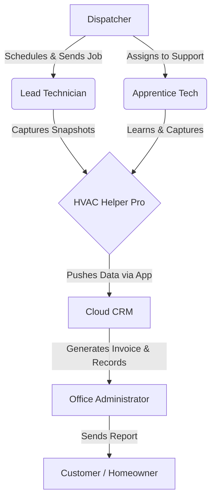

# HVAC Helper Pro – User Personas & Field Behavior Analysis

This document provides a UX critique, identifies primary and secondary personas, outlines critical field-behavior questions, and defines structured persona profiles for the HVAC Helper Pro handheld troubleshooting device.

---

## 1. Critique of the Current PRD Persona
The current [PRD.md](file:///c:/Users/joshu/projects/hvac-helper-tool/docs/PRD.md) assumes a single persona: *"Field Service Technician on residential split-system AC."* 

While targeting a single primary user group is a good starting point for an MVP, the current description is highly simplified and makes several critical assumptions that do not hold up to real-world field research.

### What is Missing
* **Varying Experience Levels:** The PRD assumes all technicians have the same diagnostic expertise. It ignores the massive differences in workflow, speed, and confidence between a seasoned Lead Technician and a first-year Apprentice.
* **Ergonomics & Physical Reality:** It ignores physical constraints: sweating, grease on hands, wearing heavy safety gloves, holding flashlights, maneuvering in 140°F attics, or crawling under dark residential decks.
* **Cognitive Load & Time Pressure:** Technicians are under high stress (e.g., severe heat, angry homeowners, back-to-back dispatch calls). Complex dial-in operations or multi-button sequences introduce high error rates.
* **Accessibility Context:** It ignores safety glasses (which can be tinted or dirty), hearing protection (which prevents hearing audio cues), and color-blindness (which affects interpreting Green/Amber/Red LEDs).

### What is Wrong / Contradictory
* **Device Form Factor Mismatch:** The persona description says the technician "carries a tablet," but the user stories and app specs assume a "phone" (e.g., "data transmitted to the phone", "FAB full-width on mobile"). In practice, technicians rarely carry a tablet up a ladder or into a tight attic; they keep tablets in their service truck and use their mobile phone on-person.
* **Manual Dial-in Usability Friction:** The PRD states: *"technicians dial in pressure readings from their existing gauges."* While manual dialing is a critical constraint that keeps our product simple and inexpensive (by avoiding the massive cost, calibration requirements, and regulatory/EPA overhead of built-in pressure instrumentation), it does introduce physical input friction. The technician must read their existing calibrated analog or digital gauges, and turn two separate reostats to match. We must design the physical reostats to minimize this entry friction (e.g., tactile clicks/detents and clear live numerical display synchronization) to prevent manual input errors in high-stress field environments.

### What is Hand-Waved
* **LED Status Visibility:** A "blinking amber" or "solid green" status LED can be completely invisible in direct, blinding outdoor sunlight on a concrete pad, or when safety glasses are covered in dust.
* **OCR Camera Parsing:** The PRD expects the technician to photograph service tags for RAG lookup. In reality, service tags are frequently rusted, dirty, faded, or located in narrow, unlit spaces 3 inches from a brick wall. 
* **LLM Chat Interaction:** Expecting a technician standing in a boiling attic to open a chat interface and write out a conversational description of the work performed is unrealistic. Technicians require rapid tap-templates, voice-to-text transcription, or the ability to defer typing until they are in the truck.

---

## 2. Secondary & Ignored Personas
A successful product must fit into the broader operational ecosystem of an HVAC service company. The current PRD ignores these critical roles:



### Ignored Roles
1. **The Apprentice / Junior Technician (Field Support)**
   * **Why they matter:** They are the ones doing the bulk of the data capture or physical prep. They do not have superheat/subcool formulas memorized and need prompt-based guidance on where to place temperature clamps (suction line vs. liquid line) and return/supply air probes.
2. **The Commercial HVAC Specialist (Field User Variant)**
   * **Why they matter:** If the tool is used in commercial environments, a single split-system focus fails. Commercial systems feature multi-stage compressors, multiple circuits, and high-voltage three-stage systems. A simple "six-button" interface cannot capture multi-circuit diagnostics.
3. **The Dispatcher / Service Coordinator (Scheduler)**
   * **Why they matter:** They require real-time visibility into the "snapshot" completion to schedule the next job or verify that a diagnostic has occurred before the customer calls with complaints.
4. **The Office Administrator / Service Manager (Billing & Compliance)**
   * **Why they matter:** They are the direct consumers of the device's output. They need the snapshot to map cleanly into Field Service Management (FSM) software (e.g., ServiceTitan, Housecall Pro) to generate customer-facing before/after reports, order warranty parts, and process invoices.

---

## 3. The 8 Critical Field-Behavior Questions
Before finalizing the hardware design and mobile application UX, the following questions must be answered via observational field research:

1. **Glove Usage:** Do technicians wear safety gloves (cut-resistant, leather) or nitrile gloves during troubleshooting? Can they operate the physical buttons and turn the reostat dials with these gloves on, or do they have to take them off?
2. **Lighting & Display Readability:** Under what light extremes does troubleshooting occur? (e.g., direct noon-day sunlight on a rooftop vs. pitch-black crawlspaces). Can the OLED displays and status LEDs be read clearly in both extremes, and is there screen glare?
3. **Hands-Free Operation:** How does the technician hold the device when both hands are occupied with a manifold gauge, temperature clamps, or climbing a ladder? Does the device need a magnetic back, a kickstand, or a lanyard/belt clip hook?
4. **Thermal & Environmental Limits:** What are the actual temperature ranges the device will sit in? (e.g., left in a service van in winter at -10°F or sitting in an attic at 140°F). Will the battery safely operate and charge, and will the screen response time degrade?
5. **BLE Connectivity in Interference Zones:** How does the Bluetooth connection perform when the technician is in a basement or utility closet surrounded by heavy concrete and metal ductwork, or standing 20 feet away on a ladder?
6. **Dial-in Usability & Detents:** What are the most intuitive increments and tactile detents (e.g., physical clicks at every 1 PSI, or larger jumps) for the pressure reostats? How can we make sure dialing matches the technician's expensive, calibrated gauges quickly without causing overshooting, visual fatigue, or glove-based slippage?
7. **Service Tag Physical Access:** What percentage of condenser service tags are physically inaccessible, dirty, or faded beyond OCR recognition? What is the manual fallback speed when the camera scanning fails?
8. **Documentation Timing:** Do technicians write reports and interact with the app *at the unit* (standing in the heat/rain) or *in the truck* after finishing the physical repair? How does this dictate the sequence of the app screens?

---

## 4. User Persona Profiles

### Primary Persona: Field Service Technician

```carousel
# User Persona: Marcus "Sparky" Ramirez
**Role**: Lead Residential Service Technician (Primary Persona)

## Demographics & Context
* **Age**: 34
* **Location**: Dallas-Fort Worth, TX (Extreme summer heat)
* **Experience**: 8 Years (Licensed Journeyman)
* **Tech Proficiency**: Moderate (Uses smartphone for social media and navigation; uses ServiceTitan for work orders)
* **Device Preferences**: Ruggedized iPhone in an OtterBox case

## Behavioral Patterns
* **Usage Frequency**: 6–8 service calls per day during peak season.
* **Task Priorities**: Diagnose cooling issues quickly, get system running, document proof of work to prevent callback liability.
* **Gauge Trust**: He owns highly calibrated, expensive analog or digital manifold gauges that he trusts completely. He expects to use them directly and is comfortable inputting readings manually as long as the controls are fast, physical, and don't require screen navigation.
* **Pain Points**: Sweating into his eyes while trying to type on a phone; battery dying mid-afternoon; losing cellular signal in brick-home utility closets; fat-fingering tiny touch screens.
* **Motivations**: Commission on parts/upgrades, finishing his route on time to get home to his family, maintaining a zero-callback record.

## Goals & Needs
* **Primary Goals**: Capture "before" and "after" system health snapshots (Delta-T, Superheat, Subcooling) to justify part replacements to homeowners.
* **Secondary Goals**: Automate the tedious process of typing up service notes at the end of a long day.
* **Success Criteria**: A diagnostic cycle that takes less than 3 minutes of hands-on tool interaction.
* **Information Needs**: Real-time Delta-T calculations to confirm a unit is charging and operating correctly.

## Context of Use
* **Environment**: Boiling residential attics (120–140°F), cramped crawlspaces, and outdoor concrete pads in direct sun.
* **Distractions**: Screaming condenser fans, barking dogs, chatty homeowners, and sweat dripping onto the device.
* **Social Context**: Works independently but communicates constantly with dispatchers and homeowners.

> "I want to do my job, not spend fifteen minutes fighting a phone app while sweat is dripping onto my screen."
> "My digital gauges cost $600 and are calibrated every year. I don't need another expensive, regulated sensor to break or go out of calibration—I just need a quick way to log what my gauges are already telling me."
<!-- slide -->
# User Persona: Tyler Vance
**Role**: Apprentice HVAC Technician (Secondary Persona)

## Demographics & Context
* **Age**: 20
* **Location**: Columbus, OH
* **Experience**: 6 Months (Currently in trade school part-time)
* **Tech Proficiency**: High (Digital native, expects modern app interfaces)
* **Device Preferences**: Android (Samsung Galaxy)

## Behavioral Patterns
* **Usage Frequency**: Constantly during calls, looking up diagrams and tutorials.
* **Task Priorities**: Avoid making mistakes, learn unit diagnostics, record data accurately for his lead technician to review.
* **Pain Points**: Lack of confidence in identifying line types (liquid vs. suction); forgets how to calculate superheat vs. subcooling; fears looking incompetent in front of customers.
* **Motivations**: Passing his licensing exam, earning the trust of the lead techs, escaping apprentice wages.

## Goals & Needs
* **Primary Goals**: Get step-by-step guidance on where to place probes and verify that measurements are stable before saving.
* **Secondary Goals**: Learn the math behind HVAC diagnostics.
* **Success Criteria**: Clear visual indicators that his readings are within normal parameters.
* **Information Needs**: Visual prompts showing *exactly* where to attach sensors on different system types.

## Context of Use
* **Environment**: Similar to lead tech, but often handles the attic/crawling work while the lead tech works at the outdoor condenser.
* **Distractions**: Feeling rushed by the lead tech; nerves when talking to homeowners.
* **Social Context**: Always reports to a lead technician or service manager who audits his data.

> "I just want to make sure I put the clamps on the right pipe. If the tool can tell me I did it right, I'll sleep better at night."
<!-- slide -->
# User Persona: Donna Jenkins
**Role**: Office Administrator & Service Manager (Secondary Persona)

## Demographics & Context
* **Age**: 45
* **Location**: Atlanta, GA
* **Experience**: 12 Years managing HVAC office operations
* **Tech Proficiency**: High (Desktop-first; QuickBooks, ServiceTitan, Excel)
* **Device Preferences**: Dual-monitor Windows desktop; iPad for occasional mobility

## Behavioral Patterns
* **Usage Frequency**: Continuous desktop usage throughout the 8–5 workday.
* **Task Priorities**: Dispatching calls, billing customers, auditing technician records, ordering replacement parts from distributors.
* **Pain Points**: Trying to decipher illegible or incomplete hand-written notes; calling technicians back because they forgot to record the model and serial number; delayed billing cycles.
* **Motivations**: Streamlining office billing, keeping technicians fully scheduled, maximizing company profitability and positive reviews.

## Goals & Needs
* **Primary Goals**: Receive complete, clean, structured system snapshots instantly upon job completion to invoice clients.
* **Secondary Goals**: Automatically trigger parts ordering when a technician identifies a failed compressor or coil.
* **Success Criteria**: Invoices sent out within 1 hour of job completion with professional, automated customer reports.
* **Information Needs**: Verified model and serial numbers, before/after refrigerant pressures/temperatures.

## Context of Use
* **Environment**: Air-conditioned, well-lit office environment; high multitasking.
* **Distractions**: Inbound phone calls, parts delivery alerts, technicians calling in with questions.
* **Social Context**: Acts as the central hub between technicians, homeowners, and parts distributors.

> "A job isn't finished until the paperwork is complete. If the technicians don't document their readings, we don't get paid by the home-warranty companies."
```

---

## 5. Persona Requirements Mapping
The following matrix highlights how different user personas impact the functional requirements of the HVAC Helper Pro system:

| Persona | Key Requirement | Hardware Impact | Mobile App Impact |
| :--- | :--- | :--- | :--- |
| **Lead Tech (Marcus)** | High-speed, rugged, tactile operation | High-contrast OLEDs, glove-friendly buttons, rubberized drop protection | Minimal clicks to submit, high-contrast UI (Light/Dark themes), offline caching |
| **Apprentice (Tyler)** | Educational support & error prevention | LED sequence indicators guiding button press order | Step-by-step probe placement guide, safety alerts, auto-calculation displays |
| **Service Manager (Donna)** | Standardized, auditable data output | Persistent diagnostic NVS log for unit validation | Instant background sync, structured JSON payload, direct CRM/FSM API integration |

---

## 6. Recommended PRD Updates & Next Steps
To make the [PRD.md](file:///c:/Users/joshu/projects/hvac-helper-tool/docs/PRD.md) trustworthy and ready for engineering execution:

1. **Hardware Action:** Refine the tactile feedback of the 6 buttons and the torque resistance of the reostats to support heavy-duty work gloves.
2. **Firmware Action:** Implement high-brightness flashing profiles for the status LEDs so they are visible under extreme outdoor glare.
3. **App Action:** Introduce a "Simplified Field Mode" that allows quick voice notes as an alternative to typing, and structure the data schema to support multi-circuit systems (anticipating commercial expansion).
4. **Research Action:** Conduct 3 field-shadowing sessions with residential service technicians to validate the 8 critical field-behavior questions listed in Section 3.

**UX Researcher**: Antigravity  
**Date**: May 22, 2026  
