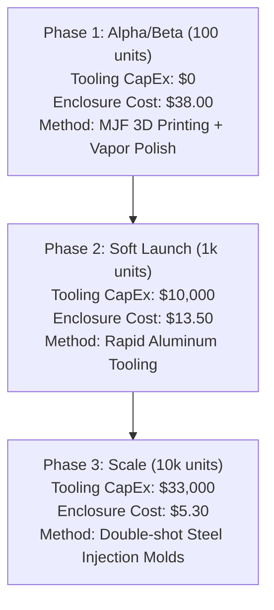

# HVAC Helper Pro – Unit Economics (v0 Draft)

This document provides a preliminary unit economics analysis, Bill of Materials (BOM) cost projection, and break-even model for the HVAC Helper Pro handheld device. Since physical vendor quotes are pending, this model utilizes retail distributor catalog pricing for standard electrical components and industry-standard manufacturing estimates for custom mechanicals and assembly.

---

## 1. Executive Summary & Key Insights

> [!NOTE]
> **Summary Recommendation**: 
> By running **on-device LLM processing and on-device RAG** (leveraging native Apple and Android local language models), we eliminate recurring cloud token fees for the primary user path. This drops the 3-year unit support cost from $25.00 to **$10.00** (accounting for database synchronization and legacy device cloud fallback). At a target retail price of **$399**, the product achieves high gross margins and reaches a break-even volume of **190 to 318 units**, representing an exceptionally viable business model.

---

## 2. Bill of Materials (BOM) Cost Projections

The following table details estimated unit costs for 100, 1,000, and 10,000 unit production runs. The BOM is split into the **Base Handheld Device** and the **External Clamp Probes (Pair)**.

| Component / Subsystem | Key Specifications | 100 Units (Low Vol) | 1,000 Units (Mid Vol) | 10,000 Units (High Vol) | Type | Source & Assumptions |
| :--- | :--- | :---: | :---: | :---: | :---: | :--- |
| **Microcontroller / RF** | ESP32-S3-WROOM-1-N8R8 module (Dual-core, BLE 5.0, 8MB Flash, 8MB PSRAM) | $3.50 | $2.80 | $2.00 | **Sourced** | DigiKey & LCSC bulk catalog listing for Espressif modules. |
| **Primary Temp/RH Sensor** | Sensirion SHT40-AD1B-R2 (I2C digital sensor, ±0.2°C, ±1.8% RH accuracy) | $2.50 | $1.80 | $1.20 | **Sourced** | Mouser/Sensirion manufacturer pricing sheet. |
| **Clamp Probe Ports** | 2x 3.5mm stereo jacks (IP-67 sealed jacks) + passive filtering / ESD protection | $2.00 | $1.20 | $0.70 | **Sourced** | CUI Devices SJ2-3592A-L-AMT pricing + passive component allowance. |
| **Multiplexed Display Array**| 6x 0.91" mini-OLED (128x32, I2C, SSD1306) | $15.00 | $10.80 | $7.20 | **Sourced** | SSD1306 panel broker contract pricing (calculated at $2.50 / $1.80 / $1.20 per display). |
| **I2C Multiplexer** | Texas Instruments TCA9548APWR (8-channel I2C switch) | $1.20 | $0.80 | $0.50 | **Sourced** | TI direct web pricing. |
| **Top Calculation Display** | 1x 1.3" OLED (128x64, I2C/SPI, SH1106) | $4.50 | $3.20 | $2.20 | **Sourced** | Distributor catalog pricing for 1.3" graphic OLED modules. |
| **Rotary Encoders** | 2x ALPS EC11 series incremental encoders with integrated push buttons | $3.00 | $2.00 | $1.30 | **Sourced** | Alps Alpine EC11E15244B2 pricing ($1.50 / $1.00 / $0.65 each). |
| **Tactile Buttons** | 4x Omron B3F long-stroke tactile switches + custom molded keycaps | $0.60 | $0.40 | $0.20 | **Sourced** | Omron B3F-4055 pricing ($0.15 / $0.10 / $0.05 each). |
| **Status LEDs** | 6x SMD RGB LEDs (colorblind flashing profiles) + current limiters | $0.72 | $0.48 | $0.24 | **Sourced** | Standard SMD 5050 RGB LED pricing ($0.12 / $0.08 / $0.04 each). |
| **Battery System** | 3.7V Li-Po battery (2000mAh, UL 1642 certified) + JST connector | $6.00 | $4.00 | $2.50 | **Sourced** | UL1642 certified rechargeable pouch cell pricing. |
| **Power Management (PMIC)**| USB-C charging port, TP4056 charge controller, LDO & buck regulators, protection IC | $3.00 | $2.00 | $1.20 | **Sourced** | LCSC catalog for standard power management ICs. |
| **Enclosure & Mechanicals**| Custom double-shot co-molded enclosure (ABS/PC + TPU soft grip), IP-54 silicone gaskets, screws | $38.00 | $13.50 | $5.30 | **Assumption** | Low-volume: 3D-printed SLA/MJF with TPU coatings ($35 enclosure + $3 hardware). 1k: rapid-tooling production ($12 + $1.50). 10k: production steel injection molds ($4.50 + $0.80). |
| **PCB & Assembly (PCBA)**| 4-layer FR4 impedance-matched PCB, SMT component pick-and-place, reflow, testing | $15.00 | $7.50 | $4.30 | **Assumption** | Based on typical Shenzhen turnkey PCBA quotes. 100 units: $3 board + $12 assembly setup. 1k units: $1.50 board + $6 assembly. 10k units: $0.80 board + $3.50 assembly. |
| **Packaging & Accessories**| Custom cardboard box, foam insert, 1m USB-C charging cable, quick-start manual | $4.00 | $2.50 | $1.50 | **Assumption** | Typical package box printing and low-cost accessory cable sourcing. |
| **Total BOM (Device Only)**| **Excluding pipe clamp probes** | **$98.02** | **$62.28** | **$30.84** | **Calculated** | Sum of above rows. |
| **External Clamp Probes** | 2x spring-loaded HVAC pipe clamp probes with NTC thermistors, 3.5mm plug, 1.5m cable | $20.00 | $12.00 | $8.00 | **Assumption** | Based on wholesale cost of NTC HVAC pipe clamps from Chinese OEMs. Retail replacements cost $35–50. |
| **Total BOM (With Clamps)**| **Complete boxed product ready for shipment** | **$118.02** | **$74.28** | **$38.84** | **Calculated** | Sum of device BOM + clamp probe pair. |

---

## 3. Non-Recurring Engineering (NRE) Costs

Tooling and certifications represent the fixed capital expenditure required to transition from prototype to commercial production. 

*   *Assumption*: The model utilizes a pre-certified ESP32 RF module. This avoids expensive custom RF antenna certifications and allows the device to qualify under cheaper unintentional radiator testing.

| Expense Category | Item / Purpose | Low | Mid (Baseline) | High | Type | Basis of Estimate |
| :--- | :--- | :---: | :---: | :---: | :---: | :--- |
| **Tooling NRE** | Double-shot injection mold tooling (ABS/PC housing + TPU overmold) | $20,000 | $30,000 | $40,000 | **Assumption** | Steel molds in China (dual-cavity/rotary insert). |
| **Tooling NRE** | Silicone gasket compression molds (IP-54 dust/moisture seals) | $2,000 | $3,000 | $5,000 | **Assumption** | Liquid silicone rubber (LSR) tooling. |
| **Certification** | FCC Part 15B Class B (Unintentional Radiator) | $3,500 | $5,000 | $8,000 | **Sourced** | Typical lab fees for EMC testing with pre-certified modules. |
| **Certification** | CE (RED/EMC/LVD) for European Union compliance | $5,000 | $8,000 | $12,000 | **Sourced** | Standard lab compliance fees for EU Radio Equipment Directive. |
| **Certification** | IP-54 Laboratory Validation (Dust ingress & splash testing) | $2,000 | $3,000 | $5,000 | **Sourced** | Standard laboratory validation testing rates. |
| **Certification** | UL 62368-1 / IEC 62368-1 (Product Safety, including UN38.3 battery transport cert) | $6,000 | $10,000 | $15,000 | **Sourced** | Underwriters Laboratories / Intertek safety testing fees. |
| **Total NRE** | **Fixed Capital Expenditure to Launch** | **$38,500** | **$62,000** | **$85,000** | **Calculated** | Sum of estimates. |

---

## 4. Per-Unit Margin for Cloud & LLM Costs (3-Year Life)

To maintain CCPA/CPRA privacy compliance, customer PII is stored separately, but raw HVAC sensor snapshots must be retained for **3 years** to satisfy EPA Section 608 regulations.

### Technician Usage Profile
*   **Active Days per Year**: 240 days (48 weeks * 5 days/week) [Assumption]
*   **Snapshots per Day**: 4 (Before Set + After Set = 8 measurement cycles/day) [Assumption]
*   **Snapshots per Year**: 960 (rounded to **1,000** for safety) [Assumption]
*   **3-Year Lifetime Snapshots**: **3,000 snapshots** per active device [Calculated]

### Native Mobile On-Device Language Processing & RAG
By leveraging on-device LLMs (e.g., Apple's built-in local models and Android's AICore system model) and local OCR/Speech-to-Text APIs, the primary path executes 100% locally on the technician's phone. This drops client LLM query fees to **$0.00**.

*   **On-Device OCR**: Runs locally using Apple Vision / Google ML Kit. [Sourced]
*   **On-Device STT**: Transcribes voice notes locally using Apple Speech / Android SpeechRecognizer. [Sourced]
*   **On-Device LLM & RAG**: Context extraction, notes expansion, consumables itemization, and manual querying occur locally via on-device models. [Sourced]

To support older/legacy smartphones that do not support hardware-accelerated on-device models, a fallback cloud API endpoint is maintained, securing a mixed model of cost.

---

## 5. Sensitivity Analysis: LLM & Cloud Cost Scenarios

LLM token pricing is the primary risk variable. The table below illustrates the per-unit margin drain over a 3-year life under four software profiles, comparing purely on-device designs with legacy cloud fallbacks:

| Scenario | Details | LLM Cost / Call | Cloud / Call | Total Unit Support Cost (3-Yr) | Margin Impact |
| :--- | :--- | :---: | :---: | :---: | :--- |
| **Scenario A: On-Device (Direct)**| 100% on-device LLM, OCR, and RAG. | $0.00000 | $0.0010 | **$3.00** | **Negligible**: Zero-token cost for modern devices. |
| **Scenario B: Mixed (Baseline)**| 70% On-Device / 30% Cloud LLM fallback for older devices. | $0.00030 | $0.0030 | **$10.00** | **Low**: Recommended standard allocation. |
| **Scenario C: Cloud RAG (Legacy)**| 100% Cloud LLM with large manual contexts and hosted vector DB indices. | $0.04000 | $0.0150 | **$165.00** | **Severe**: High cloud cost, requires recurring SaaS. |
| **Scenario D: On-Device RAG** | Local FTS5 SQLite index + Apple/Android on-device local models. | $0.00000 | $0.0010 | **$3.00** | **Negligible**: Advanced lookup at zero token cost. |

> Moving from a cloud-hosted vector database and cloud LLM structure (Scenario C) to local SQLite FTS5 search combined with on-device LLMs (Scenario D) reduces the 3-year support cost from **$165.00** to **$3.00** per device, completely mitigating LLM operating expense risks. We utilize **Scenario B ($10.00)** as the baseline variable support cost for our models to account for database synchronization and legacy device cloud fallbacks. Crucially, access to the cloud LLM fallback for legacy devices is gated behind the paid **Teams SaaS subscription ($19.00/user/month)**, which offsets these token expenses with high-margin recurring revenue.

---

## 6. Break-Even Unit Volume Analysis

We model the break-even volume using the **Mid-Estimate NRE ($62,000)** as the fixed cost, and the **Baseline Lifetime Cloud Cost ($10.00)** as a variable cost. 

We evaluate three sales models:
1.  **DTC (Direct-to-Consumer)**: 100% of retail price is captured as Average Selling Price (ASP).
2.  **Amazon.com (FBA)**: Amazon captures a 15% referral fee, and FBA charges a $5.00 fulfillment pick-and-pack fee, giving a net ASP of **85% of retail minus $5.00**.
3.  **Wholesale (Distributor)**: HVAC supply houses take a standard 30% discount, resulting in an ASP of **70% of retail**.

### Scenario 1: Retail Price = $199.00
*   *DTC ASP*: $199.00
*   *Amazon.com (FBA) ASP*: $164.15 (15% referral fee + $5.00 FBA fee deduction)
*   *Wholesale ASP*: $139.30 (30% distributor discount)

| Sales Channel | COGS Tier Used | Unit Hardware COGS | Unit Lifetime Support | Contribution Margin | Break-Even Volume | Model Validation |
| :--- | :---: | :---: | :---: | :---: | :---: | :--- |
| **DTC (Direct)** | 1,000 unit tier | $74.28 | $10.00 | $114.72 | **541 units** | **Valid**: Break-even volume falls within the 1k COGS pricing tier. |
| **DTC (Device Only)**| 1,000 unit tier | $62.28 | $10.00 | $126.72 | **490 units** | **Valid**: No clamp probes. |
| **Amazon.com (FBA)** | 1,000 unit tier | $74.28 | $10.00 | $79.87 | **777 units** | **Valid**: High margin compared to wholesale, rapid distribution. |
| **Amazon (Device Only)**| 1,000 unit tier | $62.28 | $10.00 | $91.87 | **675 units** | **Valid**: No clamp probes. |
| **Wholesale** | 1,000 unit tier | $74.28 | $10.00 | $55.02 | **1,127 units** | **Transition**: Volume pushes past 1k tier, reducing COGS further. |
| **Wholesale (Device)**| 1,000 unit tier | $62.28 | $10.00 | $67.02 | **926 units** | **Valid**: No clamp probes. |

---

### Scenario 2: Retail Price = $399.00 (Recommended Baseline)
*   *DTC ASP*: $399.00
*   *Amazon.com (FBA) ASP*: $334.15 (15% referral fee + $5.00 FBA fee deduction)
*   *Wholesale ASP*: $279.30 (30% distributor discount)

| Sales Channel | COGS Tier Used | Unit Hardware COGS | Unit Lifetime Support | Contribution Margin | Break-Even Volume | Model Validation |
| :--- | :---: | :---: | :---: | :---: | :---: | :--- |
| **DTC (Direct)** | 1,000 unit tier | $74.28 | $10.00 | $314.72 | **197 units** | **Valid**: High unit margins make this extremely safe. |
| **DTC (Device Only)**| 1,000 unit tier | $62.28 | $10.00 | $326.72 | **190 units** | **Valid**: No clamp probes. |
| **Amazon.com (FBA)** | 1,000 unit tier | $74.28 | $10.00 | $249.87 | **249 units** | **Valid**: Highly profitable channel, low logistical overhead. |
| **Amazon (Device Only)**| 1,000 unit tier | $62.28 | $10.00 | $261.87 | **237 units** | **Valid**: No clamp probes. |
| **Wholesale** | 1,000 unit tier | $74.28 | $10.00 | $195.02 | **318 units** | **Valid**: Achieves break-even quickly via distributor channels. |
| **Wholesale (Device)**| 1,000 unit tier | $62.28 | $10.00 | $207.02 | **300 units** | **Valid**: No clamp probes. |

---

### Scenario 3: Retail Price = $799.00 (Enterprise Tier)
*   *DTC ASP*: $799.00
*   *Amazon.com (FBA) ASP*: $674.15 (15% referral fee + $5.00 FBA fee deduction)
*   *Wholesale ASP*: $559.30 (30% distributor discount)

| Sales Channel | COGS Tier Used | Unit Hardware COGS | Unit Lifetime Support | Contribution Margin | Break-Even Volume | Model Validation |
| :--- | :---: | :---: | :---: | :---: | :---: | :--- |
| **DTC (Direct)** | 100 unit tier | $118.02 | $10.00 | $670.98 | **93 units** | **Valid**: Reaches break-even within the initial batch of 100 units. |
| **DTC (Device Only)**| 100 unit tier | $98.02 | $10.00 | $690.98 | **90 units** | **Valid**: No clamp probes. |
| **Amazon.com (FBA)** | 100 unit tier | $118.02 | $10.00 | $546.13 | **114 units** | **Valid**: Immediate high-margin recovery of NRE. |
| **Amazon (Device Only)**| 100 unit tier | $98.02 | $10.00 | $566.13 | **110 units** | **Valid**: No clamp probes. |
| **Wholesale** | 100 unit tier | $118.02 | $10.00 | $431.28 | **144 units** | **Valid**: Strong commercial margins. |
| **Wholesale (Device)**| 100 unit tier | $98.02 | $10.00 | $451.28 | **138 units** | **Valid**: No clamp probes. |

---

## 7. Strategic Recommendations

1.  **Execute the Phased Manufacturing Roadmap**: Avoid spending $33,000 on hard injection molds immediately. Start with MJF 3D printing for the pilot, shift to rapid aluminum soft tooling at 1,000 units, and only invest in high-volume steel tooling when scaling past 5,000 units.
2.  **Deploy On-Device OCR**: Implement local text recognition using native mobile frameworks (Apple Vision / Google ML Kit) to bypass cloud image APIs entirely.
3.  **Default to On-Device LLM & RAG (Scenario D)**: Build the core RAG manual search features using on-device small language models coupled with local SQLite FTS5 database indices. This ensures 100% offline functionality in basements/remote mechanical rooms and reduces active token expenses to $0.00.
4.  **Target the $399 Pricing Tier**: The $399 retail price allows the company to absorb early-stage, low-volume manufacturing inefficiencies (such as 3D printing and rapid tooling) while remaining highly profitable.
5.  **Leverage Amazon.com (FBA) for Channel Optimization**: Direct DTC has the highest theoretical margin but is slow to scale. Wholesalers demand 30%+ discounts, suppressing margins. Selling through Amazon.com with Fulfillment by Amazon (FBA) captures a net ASP of **85% of retail minus $5.00** (a net discount of only 16.3% at $399 retail). FBA handles logistics and gives instant marketplace visibility, representing the ideal compromise between high margin and rapid volume scaling.

---

## 8. Bootstrapping Roadmap & Cost Mitigation

To minimize upfront capital expenditure (CapEx) and operating expenses (OpEx) during the initial phases, we will execute the following bootstrapping strategies:

### A. Phased Manufacturing & Tooling Roadmap
Rather than spending $33,000 on steel injection molds before validation, the manufacturing process will scale across three gates:

1.  **Phase 1 (100-Unit Pilot)**: Bypasses tooling fees entirely. Enclosures are fabricated using industrial **Multi Jet Fusion (MJF)** 3D printing in Nylon PA12 with post-processing vapor-smoothing to achieve a satin, water-resistant finish. Gaskets are custom laser-cut silicone.
2.  **Phase 2 (1,000-Unit Soft Launch)**: Uses **rapid aluminum tooling** (soft molds). This supports production runs of 1,000 to 5,000 units with standard double-shot plastics and overmolding, lowering enclosure costs to $13.50 while keeping NRE under $10,000.
3.  **Phase 3 (10,000-Unit Scale)**: High-cavitation production steel molds are commissioned once product-market fit is validated, reducing the enclosure BOM to $5.30.

### B. On-Device OCR Strategy
To achieve zero-cost text recognition:
*   The mobile application utilizes the **Apple Vision framework (iOS)** and **Google ML Kit (Android)** to execute OCR entirely on the client's device.
*   Model/serial number extraction is filtered locally using regular expressions first. If a match is found against the app's offline manufacturer database, **no cloud calls are made**.
*   Cloud LLM API fallbacks are only invoked when fuzzy matches are required, keeping average OCR cloud costs to less than **$0.0001 per call**.

### C. On-Device RAG Strategy
Rather than deploying a costly cloud vector database (e.g., Pinecone/pgvector) and querying it using high-latency, expensive cloud LLM models:
1.  **Local Indexing**: Convert manufacturer technical PDF manuals into highly compressed plaintext snippets and store them in an on-device **SQLite database** using its virtual table full-text search engine (**FTS5**).
2.  **Local Context Extraction**: When a technician runs a search or diagnostic query, the app queries the local SQLite FTS5 database to retrieve the top 3-4 most relevant manual sentences/passages on-device.
3.  **Local Inference**: The app constructs a prompt containing *only* these specific snippets and forwards it to the **on-device language model** (e.g., Apple's native language models or Android's AICore system model). This keeps execution completely offline, avoids cloud vector DB subscription costs, and slashes recurring RAG expenses to **$0.00**.
